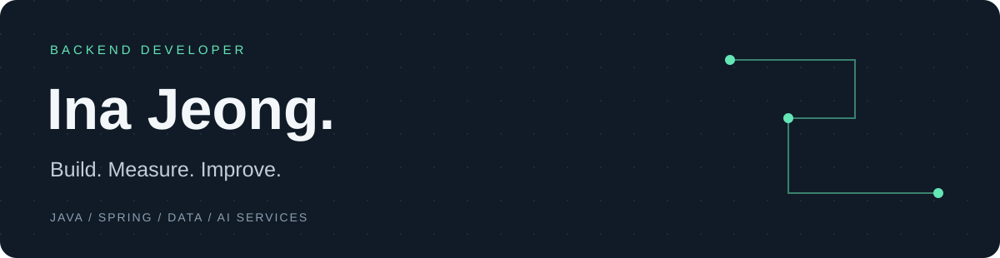

  
  
  

### 안녕하세요, 백엔드 개발자 정인아입니다.

좋은 결과만큼, 문제를 풀어가는 과정에서 배우는 것을 소중하게 생각합니다. 
확신이 없는 순간에도 시도를 이어가며, 어제보다 조금 더 나은 개발자가 되고자 합니다. 
팀과 함께 고민하고 배우며 더 나은 해결책을 찾아가고 싶습니다.

## 💪 Skills

**Backend** 

**Data & Infrastructure** 

**AI & Experiments** 

프로젝트와 실험에서 사용한 기술입니다.

## 🚀 Selected Projects

| 프로젝트 | 서비스와 담당 역할 | 살펴볼 내용 |
| :--- | :--- | :--- |
| **[PORI](https://github.com/InaJeong73/pori-backend)** | AI 포트폴리오 리뷰 플랫폼 · 팀장 / 백엔드 단독 개발 | Spring API, 비동기 평가 흐름, Cloud Run 운영 경험 · 연합해커톤 **팀 대상** |
| **[Dear.K](https://github.com/InaJeong73/deark-backend)** | 레터링 케이크 큐레이션·주문 플랫폼 · 백엔드 개발 | ERD·시스템 설계, QueryDSL 조회, 배포 환경과 협업 |
| **[AjouFinder](https://github.com/InaJeong73/AjouFinder)** | 교내 분실물·발견물 관리 · 개인 백엔드 프로젝트 | 게시물 필터링, 위치 관리, 인증 API |

PORI·Dear.K는 팀 이력을 보존한 개인 개발본입니다. 현재 구현과 당시 경험, 개선 계획은 각 README에서 확인할 수 있습니다.

## 🌷 Experience

- **SSAFY 16기 Web 트랙** — 교육 중 (2026.07–)
- **엑스페릭스 알고리즘 인턴** — 위조지문 검출 모델 학습·평가 (2025.12–2026.02)
- **엘에스웨어 품질자동화 인턴** — 서버보안 솔루션 QA·Python 반복 검증 자동화 (2025.07–08)
- **KUSITMS 31기** — Dear.K 및 KOBACO 산학협력 AiSAC 백엔드 개발

## 📊 GitHub & Algorithm

  
  

🌈 Most Used Languages

 

공개 저장소의 코드 비중을 보여주는 참고 자료입니다.

📚 더 많은 프로젝트와 학습 기록

- [CodingTest_Java](https://github.com/InaJeong73/CodingTest_Java) — 백준·프로그래머스·SWEA 풀이
- [RoadMaster](https://github.com/InaJeong73/RoadMaster) — Java 객체지향 차량·통행료 관리
- [TtoGal](https://github.com/InaJeong73/Ttogal) — 카드 수집형 맛집 탐색 서비스의 백엔드 개발 기록
- [Solved.ac](https://solved.ac/shlovejo2/) — 알고리즘 학습 프로필

 

기업 인턴 과제와 일부 팀 프로젝트의 소스는 공개 범위가 제한되어 있습니다. 프로젝트별 코드와 경험 요약은 [프로젝트 안내](docs/projects.md)에서 확인할 수 있습니다.
